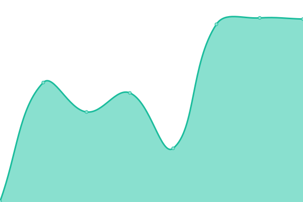

# [📈 Live Status](https://openbb-finance.github.io/uptime): <!--live status--> **🟧 Partial outage**

This repository contains the open-source uptime monitor and status page for [OpenBB](www.openbb.co), powered by [Upptime](https://github.com/upptime/upptime).

With [Upptime](https://upptime.js.org), you can get your own unlimited and free uptime monitor and status page, powered entirely by a GitHub repository. We use [Issues](https://github.com/openbb-finance/uptime/issues) as incident reports, [Actions](https://github.com/openbb-finance/uptime/actions) as uptime monitors, and [Pages](https://openbb-finance.github.io/uptime) for the status page.

<!--start: status pages-->
<!-- This summary is generated by Upptime (https://github.com/upptime/upptime) -->
<!-- Do not edit this manually, your changes will be overwritten -->
<!-- prettier-ignore -->
| URL | Status | History | Response Time | Uptime |
| --- | ------ | ------- | ------------- | ------ |
|  [openbb website](https://openbb.co) | 🟩 Up | [openbb-website.yml](https://github.com/piiq/uptime-test/commits/HEAD/history/openbb-website.yml) | 

 118ms
     
 | 

<a href="https://piiq.github.io/uptime/history/openbb-website">100.00%</a>
    

|  [openbb docs](https://docs.openbb.co/) | 🟩 Up | [openbb-docs.yml](https://github.com/piiq/uptime-test/commits/HEAD/history/openbb-docs.yml) | 

 169ms
     
 | 

<a href="https://piiq.github.io/uptime/history/openbb-docs">100.00%</a>
    

|  openbb hub | 🟩 Up | [openbb-hub.yml](https://github.com/piiq/uptime-test/commits/HEAD/history/openbb-hub.yml) | 

 154ms
     
 | 

<a href="https://piiq.github.io/uptime/history/openbb-hub">100.00%</a>
    

|  openbb pro | 🟩 Up | [openbb-pro.yml](https://github.com/piiq/uptime-test/commits/HEAD/history/openbb-pro.yml) | 

 577ms
     
 | 

<a href="https://piiq.github.io/uptime/history/openbb-pro">100.00%</a>
    

|  openbb pro backend | 🟩 Up | [openbb-pro-backend.yml](https://github.com/piiq/uptime-test/commits/HEAD/history/openbb-pro-backend.yml) | 

 18ms
     
 | 

<a href="https://piiq.github.io/uptime/history/openbb-pro-backend">100.00%</a>
    

|  openbb ada | 🟥 Down | [openbb-ada.yml](https://github.com/piiq/uptime-test/commits/HEAD/history/openbb-ada.yml) | 

 143ms
     
 | 

<a href="https://piiq.github.io/uptime/history/openbb-ada">100.00%</a>
    

<!--end: status pages-->

[**Visit our status website →**](https://openbb-finance.github.io/uptime)

## 📄 License

- Powered by: [Upptime](https://github.com/upptime/upptime)
- Code: [MIT](./LICENSE) © [OpenBB](www.openbb.co)
- Data in the `./history` directory: [Open Database License](https://opendatacommons.org/licenses/odbl/1-0/)
